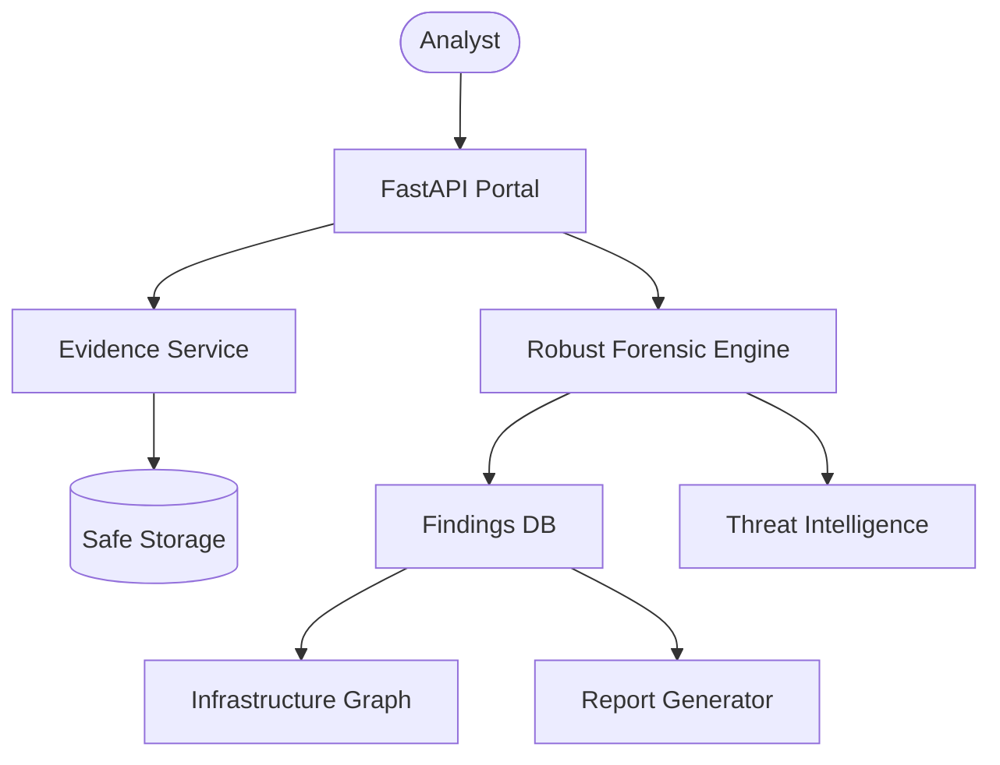

# FORENSIGHT SIH V2 Architecture

## Description
This diagram illustrates the data flow:
1. **Analyst** uploads raw EML via the API.
2. **Evidence Service** handles secure storage and hashing.
3. **Forensic Engine** performs standalone analysis.
4. Extracted IOCs and Findings populate the **Database** and are rendered in the **Infrastructure Graph** and **Report Generator**.
